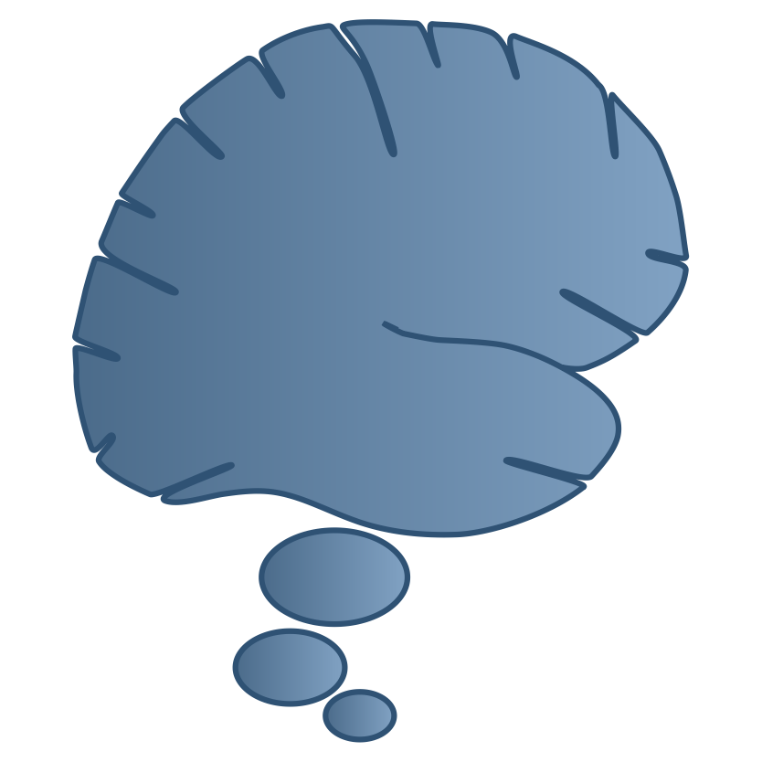

+++
URL = ""
Title = ""
+++

Welcome to **The Grey Space Poetry Collection**, focusing on the themes discussed at [grey-space.org](https://grey-space.org) and beyond, including: brains, reality, life, love, and, especially, death.

This is the work of Randall C. O'Reilly, mostly from his early adulthood, wrestling with the impossible fact of mortality and a growing understanding of the human brain: an organ composed of neurons, bathed in sea water, unambiguously organized in the same way as every other mammal on the planet. What the actual fuck is going on here, seriously? This is not OK. And yet, in the finest _grey-space_ tradition, it is actually perfect, because: (a) it is reality, and (b) a great motivator to do lots of stuff you might not otherwise do (like write intimate, crazy poetry and share it with "perfect" strangers).

This content should probably carry a **TRIGGER WARNING**: this work follows the [[The Straight and Wide Path]], serving as a kind of exposure therapy to deal with my fears. I feel compelled to add that I feel like I'm generally a very happy, well-adjusted person, despite what you might think from these poems :) Some notes:

* [[A Parody of Winds]] is a relatively safe place to start.
* [[The Origin of Species]] is one of my favorite psychedelic ones.
* [[We are all Communists]] wrestles with life as a parallel distributed network of neurons (also [[The Simultaneity of Rain]]).
* [[Aliens]] -- are you with me?

If you want to read about the philosophy behind these musings, see the main [grey-space.org](https://grey-space.org) website. For more than you'd ever want to know about the brain, see: [compcogneuro.org](https://compcogneuro.org).

> The Grey Space is the place where ideas live. It is grey because the ultimate truths of the universe are contractory, neither black nor white but rather a beautiful grey space full of conflict and contradiction, that nevertheless admits to a perfectly self-consistent overall level of understanding. There is nothing mysterious about this grey space, and yet it holds all of the mysteries of the universe within it. This grey space lives within the grey matter of my brain, and your brain, and all other such systems capable of understanding these ideas.

## Chronology

* 1985-10-17: [[Wild Mad Strokes]]
* 1985-11-??: [[The Teflon Abyss]]
* 1985-11-??: [[The Answer]]

* 1986-06-04: [[The Truth of Is]]
* 1986-06-04: [[Come a Long Gone Nowhere]]
* 1986-09-??: [[The Human Condition]]

* 1987-04-18: [[Liquid Moments at Night]]
* 1987-11-01: [[Limbo Man]]

* 1988-12-01: [[The Colossal Sphere]]

* 1989-01-06: [[The Straight and Wide Path]]
* 1989-01-08: [[The Encroaching Incline]]
* 1989-01-??: [[Pool of Desires]]
* 1989-02-??: [[Time's Shadow]]
* 1989-04-22: [[Yankee Doodle]]
* 1989-07-??: [[Sex and Death]]
* 1989-07-??: [[The Unmasking]]
* 1989-08-??: [[Run for your Lives!]]
* 1989-10-??: [[Creative Observation]]
* 1989-11-??: [[Brick Road]]
* 1989-11-??: [[Mystery Grease]]
* 1989-11-14: [[Cold Insanity]]

* 1990-01-08: [[The Phosphor Dream]]
* 1990-01-25: [[We are all Communists]]
* 1990-04-28: [[The Need for People]]
* 1990-04-29: [[Jacqueline Sublime]]
* 1990-06-27: [[A Forest of Stone]]

* 1991-02-04: [[kNOw Control]]
* 1991-03-03: [[The Tenthousand Sadnesses]]
* 1991-05-20: [[Trying]]
* 1991-06-01: [[A Parody of Winds]]
* 1991-06-10: [[A Puzzled Piece]]
* 1991-07-14: [[A Warm Bath]]
* 1991-09-24: [[Ever Enough]]
* 1991-09-27: [[Open Wound]]
* 1991-11-30: [[An Old Poem]]

* 1992-01-15: [[Snow Fall]]
* 1992-04-27: [[The Onion or the Snake?]]
* 1992-07-29: [[That Glorious Day]]
* 1992-08-01: [[Olympic Memories]]
* 1992-09-12: [[Dim Yearning]]

* 1994-08-28: [[Solitude in the Center]]
* 1994-11-23: [[The Origin of Species]]

* 1995-10-01: [[Advice]]
* 1995-10-14: [[The Simultaneity of Rain]]

* 1996-04-20: [[Travel Time Zone]]

* 1997-12-23: [[As Sleep Approaches]]

* 1998-01-24: [[Always Questioning]]
* 1998-09-20: [[The Brain is a Blotter]]

* 1999-02-17: [[M.O.M.]]
* 1999-02-21: [[Aliens]]
* 1999-04-16: [[Grey Politics]]

* 2006-04-09: [[Slow Suicide]]
* 2006-06-20: [[Hanging by a Thread]]

* 2026-01-17: [[75% Water]]
* 2026-01-24: [[Loss Aversion]]
* 2026-03-07: [[An Extra Ordinary Moment]]
* 2026-03-13: [[Steps]]
* 2026-03-15: [[Surfing Downstream]]
* 2026-03-18: [[Own it All!]]
* 2026-04-03: [[Strange Manifold]]
* 2026-04-17: [[Homeless]]
* 2026-05-01: [[Lost in Transition]]
* 2026-06-12: [[Finding My Religion]]
* 2026-06-15: [[The Helicopter View]]
* 2026-06-21: [[The Monks are Cheating]]
* 2026-07-16: [[Chasing a Memory]]

