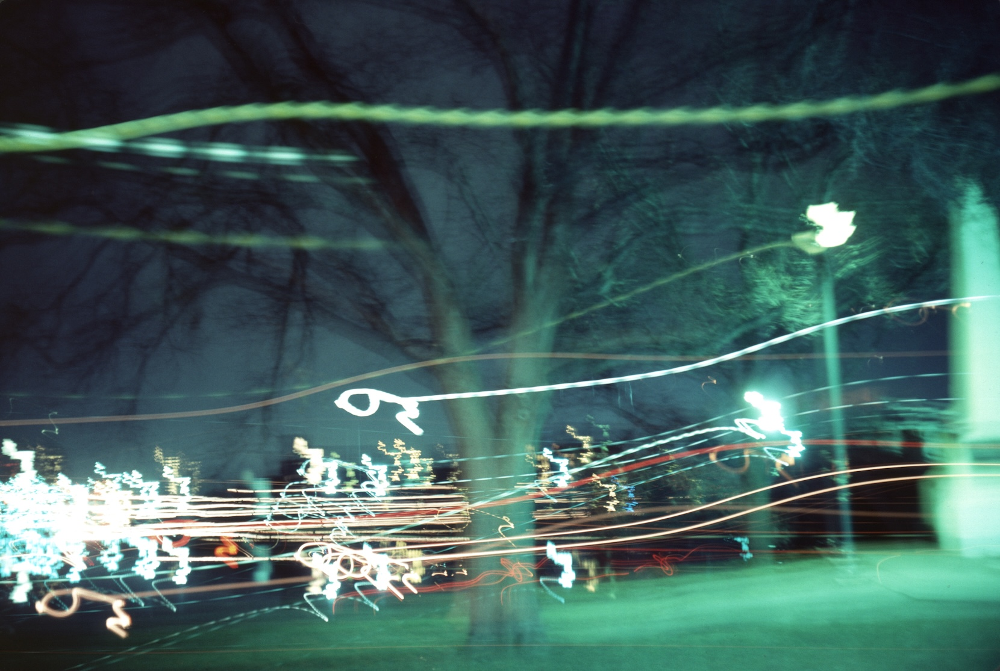

+++
Name = "Liquid Moments at Night"
Date = "1987-04-18"
+++

Mysterious, shimmering --- the liquid moments of light\
sterile, stark blue, a slowly pulsating hue\
quietly staring back at you.

The ominous solitude of the sudden view\
all of life, and this you never knew.

Youth, a moist ride on nature's dew\
You, sprouting teeth and losing _th_\
must now fight the thirsty battle of day:

Eyes, piercing that which you can not touch\
and mind, swimming inside the grey confine\
with anticipation dulling the time\
when things no longer seem to rhyme.

But the dissonance slowly subsides\
as conquests replace rides\
and you begin to see the ebb and flow of tides\
but the cold, distant moon\
has no effect on your blaring tune.

When the water is gone and nothing flows\
sleepy, time shows you who really knows.

Mysterious, shimmering, the liquid moments of night\
robed, cloaked, a slowly pulsating Lune\
searching, with muffled drive for you...\
but you're done exercising your soul right.

{id="photo_liquid-moments" style="height:40em"}

