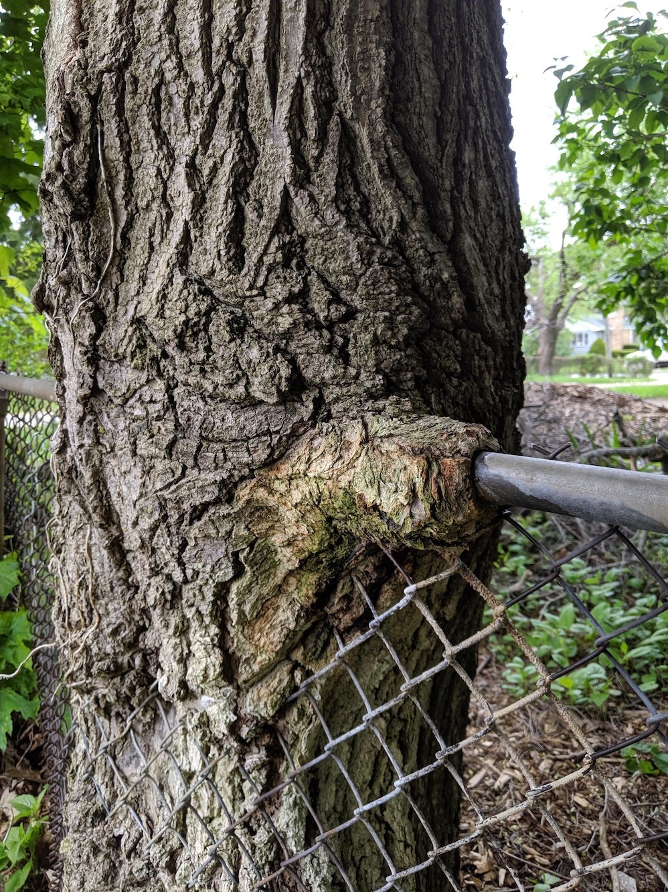

+++
Name = "M.O.M."
Date = "1999-02-17"
+++

The warm, lonely sadness\
that coats my aching mind\
after a week of madness\
I swim in pink grief.

The milk of magnesia\
soothing, sticky and moist\
Mom cradles the sick child\
in a syrup warm and mild.

The security of knowing\
that symptoms beyond my control\
have made it clear to all\
that I'm excused from life.

I can sit in my still room\
playing with blocks\
a lonely, warm child\
creating worlds without disease\
as I please.

The solitude echoes in the barren clutter\
of thoughts and fantasy\
these things just come to me\
and I to them.

But they stay away from me\
I do not share their noisy, boring world\
of games and talk.\
I like my incubation station\
where a vacation is the chance\
to bring a dream to life.

Now, as I reflect on those ancient times\
I feel the same warm, sad comfort\
sitting alone in my neater room\
with toys as words in a living\
phosphorescent fantasy

 :

 :

The continuity breaks\
the growing tree accommodating\
the chain link fence\
which passes through the gnarling mass.

Up, out, but always within\
the tree grows so organically\
and the harsh bite of cold steel\
melts into the bark\
disappearing within\
reappearing again\
unscathed.

But the cold winter wind\
blowing in these faltering days\
sends a shiver straight through the fence\
to my weak, spindly spine

I hear the world\
through this chilly ear\
I grow older year to year\
but my fence and I are forever merged\
and the cold will always bring me pain.

When my bark succumbs to the bite\
I scurry down the rustling branches\
and disappear into the warm, soft earth\
where mom put me at birth.

Looking up at the swaying, stiff edifice\
I cannot imagine the strain and strength\
I cannot endure that horrible chained fence.

I need the lonely, solitary place\
where the rosy, melancholy juice\
gives my tender, sensitive soul\
a much needed truce.

{id="photo_mom-tree" style="height:40em"}

